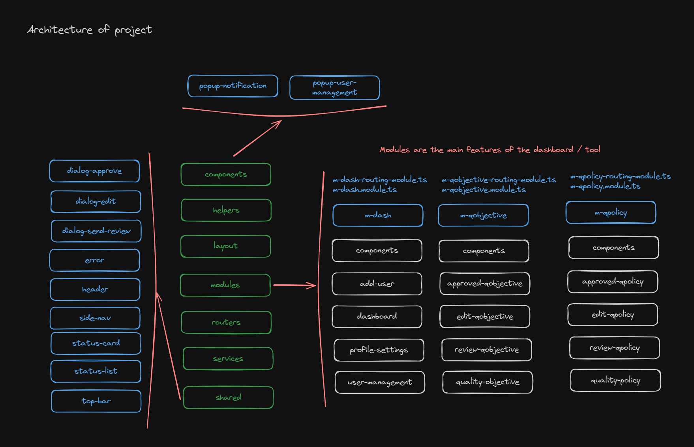

# EasyQ-Frontend NEW

## Description

-   Code is developed using Angular Framework version 16
-   Please ensure that npm version 20 is installed
-   Please ensure that Angular version 16 is installed globally

## Technical details

-   Technology used is angular version 16
-   Built in module based aproch
-   Has lazy loading for every module
-   Features are made into modules and every module has prefix name "m-"
-   Each module has its own components folder which contains shared component like dialogs only with respective to those modules
-   Login page consist of a method which will be used to access super user if in url there is no company name and if usr consost of company name i.e, domainName/companyname/login it will login to the particular company's QMS
-   "compnayname" resolver is added which checks the company name in the local storage and sets it also helps in not allowing to access other companys. In facts it will return the same copany name as it is in the local storage.

## Modules details

1. m-dash
2. m-qobjective
3. m-qpolicy
4. m-rna
5. m-sop

## Folder tree

    src
    ├── app
    |   ├── auth
    |   |   ├── login (component)
    |   |   ├── check-if-authenticated-parent.guard.ts
    |   |   └── check-if-authenticated.guard.ts
    |   ├── components
    |   |   ├── popup-notification (component)
    |   |   └── popup-user-details (component)
    |   ├── error (components)
    |   ├── helpers
    |   |   ├── company-name.resolver.ts
    |   |   └── main.interceptor.ts
    |   ├── layout (component) - the main layout of the dashboard
    |   ├── modules
    |   |   ├── m-dash (module)
    |   |   ├── m-qobjective (module)
    |   |   ├── m-qpolicy (module)
    |   |   ├── m-rna (module)
    |   |   └── m-sop (module)
    |   ├── routers
    |   |   ├── dash.routes.ts
    |   |   ├── qobjective.routes.ts
    |   |   ├── qpolicy.routes.ts
    |   |   ├── rna.routes.ts
    |   |   └── sop.routes.ts
    |   ├── services
    |   |   ├── alert.service.ts (alert dialog functions)
    |   |   ├── app_init.service.ts
    |   |   ├── authentication.service.ts
    |   |   ├── common.service.ts (common function that is shared all through)
    |   |   ├── rna.service.ts
    |   |   ├── storage.service.ts (local storage functions with encryption)
    |   |   └── user-management.service.ts
    |   ├── shared (shared module)
    |   ├── app-routing.module.ts
    |   └── app.module.ts
    ├── assets
    |   ├── fonts
    |   ├── icons
    |   └── images
    ├── environments
    ├── index.html
    ├── main.ts
    └── style.scss

## Architecture diagram

